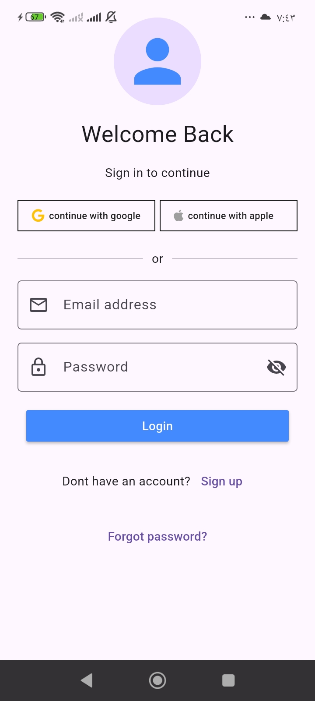

# Flutter Homework: Login Screen

A simple and modern login screen UI built with Flutter.

## Features
* **Social Login:** Buttons for "Continue with Google" and "Continue with Apple".
* **Input Fields:** Email and password fields with leading icons and a password visibility toggle.
* **Actions:** Login button, "Sign up" navigation link, and "Forgot password?" option.

## Screenshot

## Technologies
* **Framework:** Flutter
* **Language:** Dart
